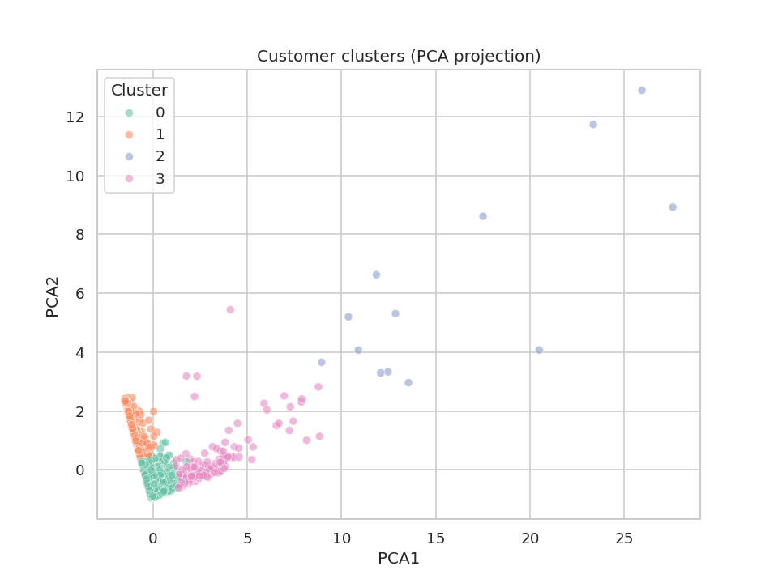

# Customer Segmentation with RFM Analysis & K-Means Clustering

An end-to-end customer segmentation project on the UCI **Online Retail**
transaction dataset (~540K rows, ~4,300 customers). Cleans raw transaction
data, engineers RFM (Recency, Frequency, Monetary) features, clusters
customers with K-Means, and presents the results in an interactive
Streamlit dashboard.

**🔗 Live demo:** _add your Streamlit Cloud URL here after deploying_



## Why this matters

Businesses can't treat every customer the same. This project groups
customers into four data-driven segments — **Champions**, **Loyal
Customers**, **New/Low-Value**, and **At Risk/Lost** — each pointing to a
different action: VIP perks, loyalty offers, onboarding nudges, or win-back
campaigns.

## How it works

1. **Clean** raw transactions — drop missing customer IDs, duplicates,
   cancelled orders (`src/pipeline.py`)
2. **Engineer RFM features** — Recency (days since last purchase),
   Frequency (distinct orders), Monetary (total spend) per customer
3. **Choose k** — compare inertia (elbow method) and silhouette score
   across k=2..8
4. **Cluster** with K-Means (k=4, scaled features, silhouette ≈ 0.62)
5. **Label segments** by their actual RFM profile — not a fixed order, since
   which cluster is "at risk" vs "new" depends on real recency numbers
6. **Visualize** — PCA projection, revenue-by-segment, PCA scatter — served
   through a Streamlit dashboard

## Results

| Segment | Customers | Total Revenue | Avg Recency (days) | Avg Frequency |
|---|---|---|---|---|
| Champions (VIP) | 13 | £1.65M | 7.4 | 82.5 |
| Loyal Customers | 204 | £2.59M | 15.5 | 22.3 |
| New / Low-Value | 3,054 | £4.13M | 43.7 | 3.7 |
| At Risk / Lost | 1,067 | £0.51M | 248.1 | 1.6 |

## Project structure

```
├── app.py                          # Streamlit dashboard
├── src/pipeline.py                 # Cleaning, RFM, clustering pipeline
├── notebooks/
│   └── customer_segmentation.ipynb # Full analysis walkthrough with charts
├── data/
│   ├── raw/                        # Raw dataset (not committed, see README)
│   └── processed/                  # Small outputs the app reads
├── assets/                         # Saved chart images
└── requirements.txt
```

## Run it locally

```bash
git clone https://github.com/<your-username>/customer-segmentation.git
cd customer-segmentation
pip install -r requirements.txt

# (Optional) regenerate data/processed from raw data — see data/raw/README.md
python src/pipeline.py

streamlit run app.py
```

## Tech stack

Python, pandas, scikit-learn (K-Means, PCA, StandardScaler), matplotlib/
seaborn, Plotly, Streamlit.

## Notes

This project builds on a segmentation concept originally suggested by a
colleague; the cleaning pipeline, cluster-labeling logic, notebook
walkthrough, and Streamlit app in this repo were written and organized by me.
